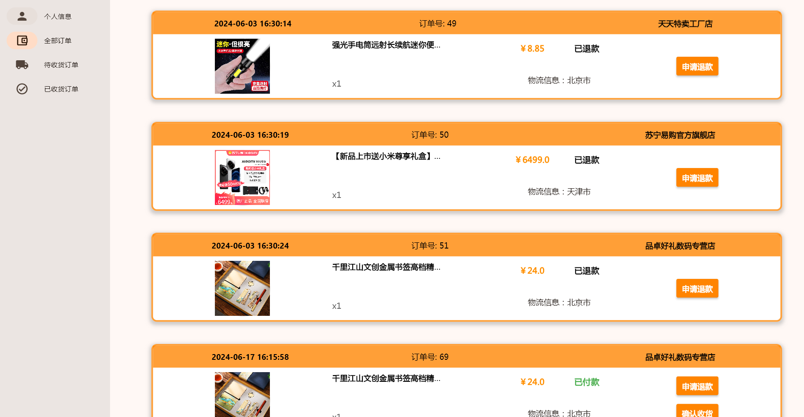
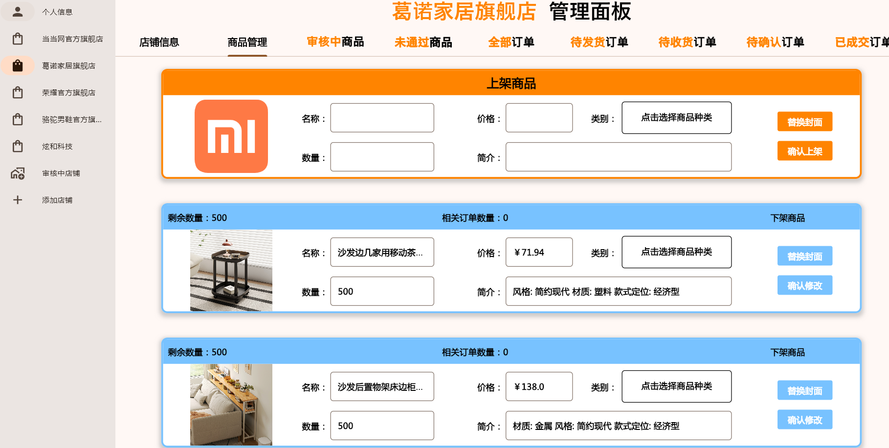
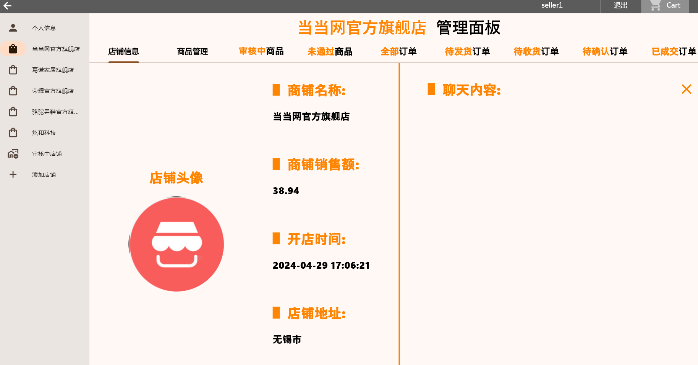

# 并夕夕电商平台

并夕夕电商平台是一个综合性在线购物平台，该平台支持**在线购物**、**客服对话**、**系统推荐**、**商品评价**等功能。

后端：FastAPI、Mysql、Redis

前端：Flutter

```
├── readme.md                      # 本文档
├── BingXiXi_UI_win                # 在线购物平台前端
├── Model                          # MySQL、Redis相关内容
├── Service		                  #  数据库增删改查代码   
├── Test		                  #  不同功能实现代码   
├── Type		                  #  定义平台中使用到的类  
├── static		                  #  存储商品图片（商品数据通过爬虫获得）   
├── utils		                  #  处理Web程序中HTTP响应   
├── requirements.txt		      #  平台环境文件   
```

平台首页


用户订单页面



商品详情页面


商家管理页面





以上仅供参考，更多功能可自行尝试
